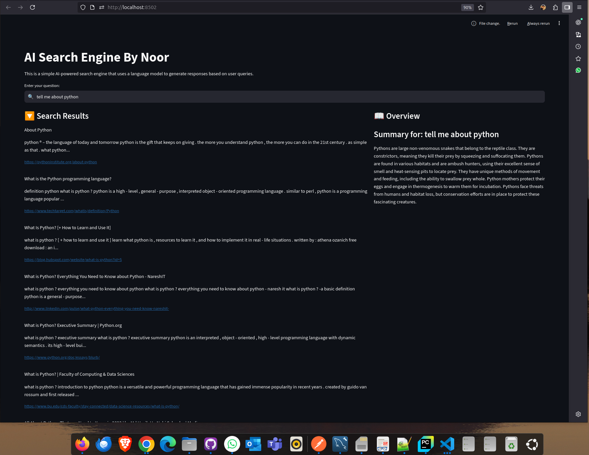
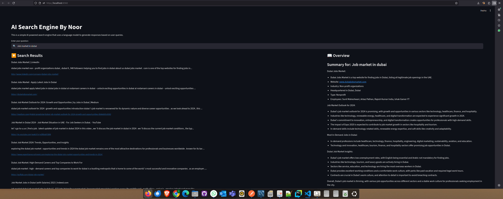

# SmartSearchSummarizer

**SmartSearchSummarizer** is a Streamlit-based AI search application that allows you to view search results from chunked data and generate concise AI-powered summaries for quick insights.

---

## Features

- **Search Results Panel**: Displays retrieved chunks of information related to your query.
- **Overview Panel**: Generates a concise summary of the retrieved chunks using GPT-3.5-turbo.
- **Streamlit Interface**: Clean, responsive, and interactive web interface.
- **Reusable LLM Engine**: Easy-to-use Python class for AI summarization.

---

## Screenshots




---

## Installation

1. Clone the repository:

```bash
git clone https://github.com/yourusername/SmartSearchSummarizer.git
cd SmartSearchSummarizer
```

2. Create a virtual environment (optional but recommended):

```bash
python -m venv venv
source venv/bin/activate  # Linux/Mac
venv\Scripts\activate     # Windows
```

3. Install dependencies:

```bash
pip install -r requirements.txt
```

4. Set your OpenAI API key as an environment variable:

```bash
export OPENAI_API_KEY="your_openai_api_key_here"   # Linux/Mac
setx OPENAI_API_KEY "your_openai_api_key_here"     # Windows
```

---

## Usage

Run the Streamlit app:

```bash
streamlit run app.py
```

- Enter your query in the search bar on the left panel.
- View retrieved chunks below the search bar.
- See the AI-generated summary/overview on the right panel.

---

## Project Structure

```
SmartSearchSummarizer/
│
├── app.py               # Main Streamlit app
├── llm_engine.py        # LLMEngine class for AI summarization
├── requirements.txt     # Python dependencies
├── README.md            # Project documentation
└── screenshot.png       # Optional screenshot for README
```

---

## LLM Engine Example

```python
from llm_engine import LLMEngine

engine = LLMEngine(api_key="your_openai_api_key_here")
chunks = [
    "LangChain is a framework for building LLM-powered applications.",
    "AI summarization improves readability by combining multiple chunks into a concise overview."
]
prompt = "Summarize the following chunks:\n" + "\n".join(chunks)
overview = engine.generate_overview_by_chunk(prompt)
print(overview)
```

---

## License

This project is licensed under the MIT License. See the [LICENSE](LICENSE) file for details.

---

## Future Enhancements

- Add file upload (PDF, TXT) for dynamic knowledge base.
- Make search results clickable to display detailed overview per result.
- Integrate optional vector database for large-scale search.
- Deploy as a web app on Streamlit Cloud or Heroku.

